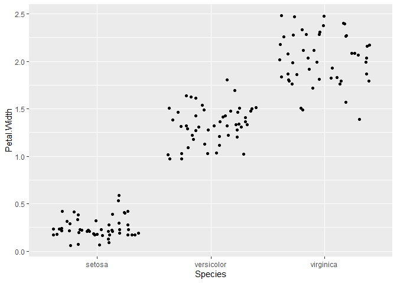

Lab 5 Assignment
================
Emily Miller
2021-02-23

Welcome to my lab 5 assignment

# Load Packages ———————————————————–

``` r
library(tidyverse)
```

# Data ——————————————————————–

``` r
iris <- as_tibble(iris)
```

# Question 1 ————————————————————–

1.  Rename each variable so that it is all lower-case and uses an
    underscore \_ instead of a period . in the name (the recommended
    coding style in the tidyverse style guide). Print the resulting
    table.

<!-- end list -->

``` r
rename(
  iris,
  sepal_length = Sepal.Length,
  sepal_width = Sepal.Width,
  petal_length = Petal.Length,
  petal_width = Petal.Width
)
```

    ## # A tibble: 150 x 5
    ##    sepal_length sepal_width petal_length petal_width Species
    ##           <dbl>       <dbl>        <dbl>       <dbl> <fct>  
    ##  1          5.1         3.5          1.4         0.2 setosa 
    ##  2          4.9         3            1.4         0.2 setosa 
    ##  3          4.7         3.2          1.3         0.2 setosa 
    ##  4          4.6         3.1          1.5         0.2 setosa 
    ##  5          5           3.6          1.4         0.2 setosa 
    ##  6          5.4         3.9          1.7         0.4 setosa 
    ##  7          4.6         3.4          1.4         0.3 setosa 
    ##  8          5           3.4          1.5         0.2 setosa 
    ##  9          4.4         2.9          1.4         0.2 setosa 
    ## 10          4.9         3.1          1.5         0.1 setosa 
    ## # ... with 140 more rows

# Question 2 ————————————————————–

2.  Convert the four numerical variables from cm to mm by multiplying by
    10. Print the resulting table.

<!-- end list -->

``` r
iris2 <- mutate(
  iris,
  Sepal.Length = Sepal.Length * 10,
  Sepal.Width = Sepal.Width * 10,
  Petal.Length = Petal.Length * 10,
  Petal.Width = Petal.Width * 10
)
```

# Question 3 ————————————————————–

3.  Calculate sepal area and petal area (area is equal to length
    multiplied by width). Print a table with only the variables sepal
    area, petal area, and species.

<!-- end list -->

``` r
iris2 <- mutate(iris,
       sepal_area = Sepal.Length * Sepal.Width,
       petal_area = Petal.Length * Petal.Width)

select(iris2, sepal_area, petal_area, Species)
```

    ## # A tibble: 150 x 3
    ##    sepal_area petal_area Species
    ##         <dbl>      <dbl> <fct>  
    ##  1       17.8      0.280 setosa 
    ##  2       14.7      0.280 setosa 
    ##  3       15.0      0.26  setosa 
    ##  4       14.3      0.3   setosa 
    ##  5       18        0.280 setosa 
    ##  6       21.1      0.68  setosa 
    ##  7       15.6      0.42  setosa 
    ##  8       17        0.3   setosa 
    ##  9       12.8      0.280 setosa 
    ## 10       15.2      0.15  setosa 
    ## # ... with 140 more rows

# Question 4 ————————————————————–

4.  Calculate the following statistics for the entire dataset from the
    sepal length variable and print the resulting table:

<!-- end list -->

1.  sample size
2.  maximum value
3.  minimum value
4.  range
5.  median
6.  first quartile (q1)
7.  third quartile (q2)
8.  inter-quartile range (iqr)

<!-- end list -->

``` r
summarise(
  iris,
  sample_size = n(),
  max= max(Sepal.Length),
  min= min(Sepal.Length),
  range= max-min,
  median= median(Sepal.Length),
  q1 = quantile(Sepal.Length, probs = 0.25),
  q2 = quantile(Sepal.Length, probs = 0.75),
  iqr= IQR(Sepal.Length)
)
```

    ## # A tibble: 1 x 8
    ##   sample_size   max   min range median    q1    q2   iqr
    ##         <int> <dbl> <dbl> <dbl>  <dbl> <dbl> <dbl> <dbl>
    ## 1         150   7.9   4.3   3.6    5.8   5.1   6.4   1.3

# Question 5 ————————————————————–

5.  Calculate the following statistics for each species from the petal
    width variable and print the resulting table:

<!-- end list -->

1.  sample size
2.  mean
3.  standard deviation
4.  variance
5.  standard error of the mean
6.  approximate 95% confidence interval

<!-- end list -->

``` r
speciesgrouped <- group_by(iris, Species)

PetalWidth <- summarize(
  speciesgrouped,
  sample_size = n(),
  mean_Petal.Width = mean(Petal.Width),
  sd_Petal.Width = sd(Petal.Width),
  var_Petal.Width = var(Petal.Width),
  sem = sd(Petal.Width) / (sqrt(n())),
  ci_upper_limit = mean_Petal.Width + 1.96 * sem,
  ci_lower_limit = mean_Petal.Width - 1.96 * sem
)
```

    ## `summarise()` ungrouping output (override with `.groups` argument)

``` r
PetalWidth
```

    ## # A tibble: 3 x 8
    ##   Species sample_size mean_Petal.Width sd_Petal.Width var_Petal.Width    sem
    ##   <fct>         <int>            <dbl>          <dbl>           <dbl>  <dbl>
    ## 1 setosa           50            0.246          0.105          0.0111 0.0149
    ## 2 versic~          50            1.33           0.198          0.0391 0.0280
    ## 3 virgin~          50            2.03           0.275          0.0754 0.0388
    ## # ... with 2 more variables: ci_upper_limit <dbl>, ci_lower_limit <dbl>

# Question 6 and 7————————————————————–

6 and 7. Visualize the relationship between petal width and species
using a strip plot. Then add the mean and 95% confidence interval for
each species.

``` r
ggplot(data=iris)+
  geom_jitter(mapping=aes(x=Species, y=Petal.Width))
```

<!-- -->

``` r
ggplot(data = iris) +
  geom_jitter(mapping = aes(y = Petal.Width, x = Species)) +
  geom_crossbar(
    data = PetalWidth,
    mapping = aes(
      x = Species,
      y = mean_Petal.Width,
      ymax = ci_upper_limit,
      ymin = ci_lower_limit
    ),
    color = "blue"
  )
```

<!-- -->

# Question 8 ————————————————————–

8.  Visualize the relationship between petal length, petal width, and
    species using a scatterplot. Map the two numerical variables to the
    x and y axes and map species to the color and shape aesthetics.

<!-- end list -->

``` r
ggplot(data = iris) +
  geom_point(mapping = aes(
    x = Petal.Length,
    y = Petal.Width,
    color = Species,
    shape = Species
  ))
```

<!-- -->

# Session Info ————————————————————

``` r
sessioninfo::session_info()
```

    ## - Session info ---------------------------------------------------------------
    ##  setting  value                       
    ##  version  R version 4.0.3 (2020-10-10)
    ##  os       Windows 10 x64              
    ##  system   x86_64, mingw32             
    ##  ui       RTerm                       
    ##  language (EN)                        
    ##  collate  English_United States.1252  
    ##  ctype    English_United States.1252  
    ##  tz       America/Chicago             
    ##  date     2021-02-24                  
    ## 
    ## - Packages -------------------------------------------------------------------
    ##  package     * version date       lib source        
    ##  assertthat    0.2.1   2019-03-21 [1] CRAN (R 4.0.3)
    ##  backports     1.2.0   2020-11-02 [1] CRAN (R 4.0.3)
    ##  broom         0.7.3   2020-12-16 [1] CRAN (R 4.0.3)
    ##  cellranger    1.1.0   2016-07-27 [1] CRAN (R 4.0.3)
    ##  cli           2.2.0   2020-11-20 [1] CRAN (R 4.0.3)
    ##  colorspace    2.0-0   2020-11-11 [1] CRAN (R 4.0.3)
    ##  crayon        1.3.4   2017-09-16 [1] CRAN (R 4.0.3)
    ##  DBI           1.1.0   2019-12-15 [1] CRAN (R 4.0.3)
    ##  dbplyr        2.0.0   2020-11-03 [1] CRAN (R 4.0.3)
    ##  digest        0.6.27  2020-10-24 [1] CRAN (R 4.0.3)
    ##  dplyr       * 1.0.2   2020-08-18 [1] CRAN (R 4.0.3)
    ##  ellipsis      0.3.1   2020-05-15 [1] CRAN (R 4.0.3)
    ##  evaluate      0.14    2019-05-28 [1] CRAN (R 4.0.3)
    ##  fansi         0.4.1   2020-01-08 [1] CRAN (R 4.0.3)
    ##  farver        2.0.3   2020-01-16 [1] CRAN (R 4.0.3)
    ##  forcats     * 0.5.0   2020-03-01 [1] CRAN (R 4.0.3)
    ##  fs            1.5.0   2020-07-31 [1] CRAN (R 4.0.3)
    ##  generics      0.1.0   2020-10-31 [1] CRAN (R 4.0.3)
    ##  ggplot2     * 3.3.3   2020-12-30 [1] CRAN (R 4.0.3)
    ##  glue          1.4.2   2020-08-27 [1] CRAN (R 4.0.3)
    ##  gtable        0.3.0   2019-03-25 [1] CRAN (R 4.0.3)
    ##  haven         2.3.1   2020-06-01 [1] CRAN (R 4.0.3)
    ##  hms           1.0.0   2021-01-13 [1] CRAN (R 4.0.3)
    ##  htmltools     0.5.0   2020-06-16 [1] CRAN (R 4.0.3)
    ##  httr          1.4.2   2020-07-20 [1] CRAN (R 4.0.3)
    ##  jsonlite      1.7.2   2020-12-09 [1] CRAN (R 4.0.3)
    ##  knitr         1.30    2020-09-22 [1] CRAN (R 4.0.3)
    ##  labeling      0.4.2   2020-10-20 [1] CRAN (R 4.0.3)
    ##  lifecycle     0.2.0   2020-03-06 [1] CRAN (R 4.0.3)
    ##  lubridate     1.7.9.2 2020-11-13 [1] CRAN (R 4.0.3)
    ##  magrittr      2.0.1   2020-11-17 [1] CRAN (R 4.0.3)
    ##  modelr        0.1.8   2020-05-19 [1] CRAN (R 4.0.3)
    ##  munsell       0.5.0   2018-06-12 [1] CRAN (R 4.0.3)
    ##  pillar        1.4.7   2020-11-20 [1] CRAN (R 4.0.3)
    ##  pkgconfig     2.0.3   2019-09-22 [1] CRAN (R 4.0.3)
    ##  purrr       * 0.3.4   2020-04-17 [1] CRAN (R 4.0.3)
    ##  R6            2.5.0   2020-10-28 [1] CRAN (R 4.0.3)
    ##  Rcpp          1.0.5   2020-07-06 [1] CRAN (R 4.0.3)
    ##  readr       * 1.4.0   2020-10-05 [1] CRAN (R 4.0.3)
    ##  readxl        1.3.1   2019-03-13 [1] CRAN (R 4.0.3)
    ##  reprex        0.3.0   2019-05-16 [1] CRAN (R 4.0.3)
    ##  rlang         0.4.10  2020-12-30 [1] CRAN (R 4.0.3)
    ##  rmarkdown     2.6     2020-12-14 [1] CRAN (R 4.0.3)
    ##  rstudioapi    0.13    2020-11-12 [1] CRAN (R 4.0.3)
    ##  rvest         0.3.6   2020-07-25 [1] CRAN (R 4.0.3)
    ##  scales        1.1.1   2020-05-11 [1] CRAN (R 4.0.3)
    ##  sessioninfo   1.1.1   2018-11-05 [1] CRAN (R 4.0.3)
    ##  stringi       1.5.3   2020-09-09 [1] CRAN (R 4.0.3)
    ##  stringr     * 1.4.0   2019-02-10 [1] CRAN (R 4.0.3)
    ##  tibble      * 3.0.4   2020-10-12 [1] CRAN (R 4.0.3)
    ##  tidyr       * 1.1.2   2020-08-27 [1] CRAN (R 4.0.3)
    ##  tidyselect    1.1.0   2020-05-11 [1] CRAN (R 4.0.3)
    ##  tidyverse   * 1.3.0   2019-11-21 [1] CRAN (R 4.0.3)
    ##  utf8          1.1.4   2018-05-24 [1] CRAN (R 4.0.3)
    ##  vctrs         0.3.6   2020-12-17 [1] CRAN (R 4.0.3)
    ##  withr         2.3.0   2020-09-22 [1] CRAN (R 4.0.3)
    ##  xfun          0.20    2021-01-06 [1] CRAN (R 4.0.3)
    ##  xml2          1.3.2   2020-04-23 [1] CRAN (R 4.0.3)
    ##  yaml          2.2.1   2020-02-01 [1] CRAN (R 4.0.3)
    ## 
    ## [1] C:/Users/Owner/OneDrive/Documents/R/win-library/4.0
    ## [2] C:/Program Files/R/R-4.0.3/library
